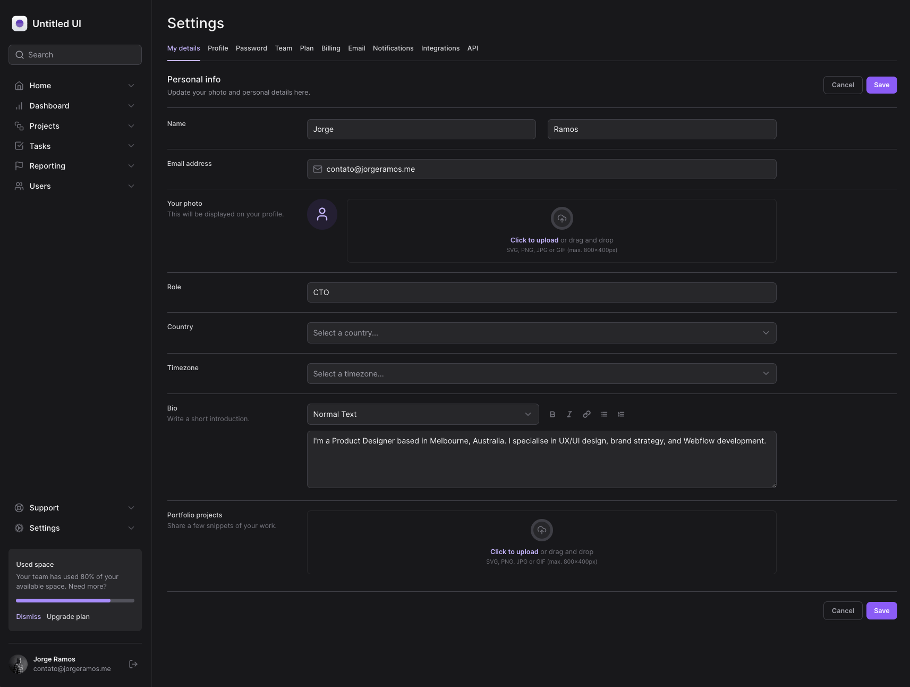
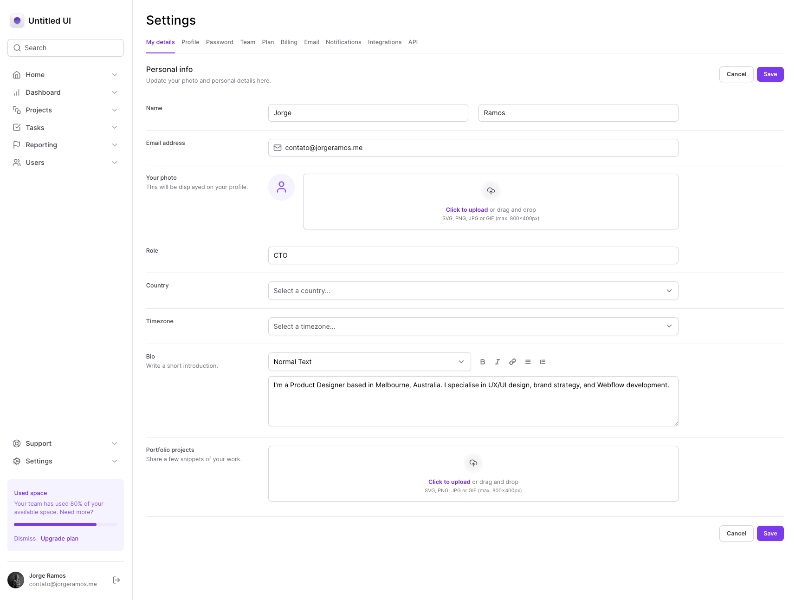

# Masterizando Tailwind

Aplicação desenvolvida no curso Masterizando o Tailwind dosponível na trilha Ignite da Rocketseat!

<p align="center">
  
</p>

<p align="center">
  
</p>


## Tecnologias Utilizadas

- **Next.js**: Um framework React que facilita a construção de aplicações web modernas e eficientes.
- **Tailwind CSS**: Um framework CSS utilitário que acelera o processo de estilização e torna as interfaces responsivas.
- **Radix-Ui**: Biblioteca open source de componentes com alta acessibilidade e desempenho.
- **lucide-react**: Bilioteca de ícones.
- **framer-motion**: Biblioteca para criação e implementação de animações interativas.
- **auto-animate**: Ferramenta para adicionar animações ao projeto.


## Como Usar

1. Clone o repositório para o seu ambiente local:

```bash
git clone git@github.com:jorginhodev/masterizando-o-tailwind.git
```

2. Instale as dependências do projeto:

```bash
npm install
```

4. Inicie o servidor de desenvolvimento:

```bash
npm run dev
```

5. Acesse a aplicação em seu navegador:

```
http://localhost:3000
```